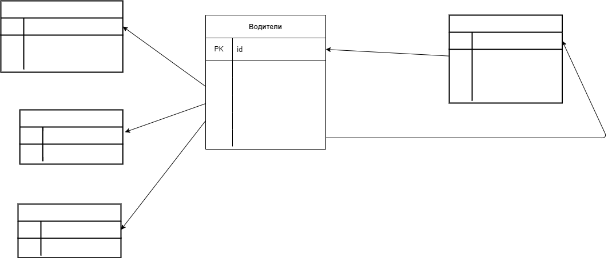

Задание 1 - 1го семинара:
Составьте таблицы для хранения сведений об общественном транспорте.

— Можно на примере автобусов.
— При составлении таблиц не берите слишком много сущностей. Ориентируйтесь на структуру типа: «У нас есть автобусы на разных маршрутах, у автобуса есть водитель, также в автобусе работает кондуктор». Более сложные/глубокие структуры пока лучше не брать.

Описание
Водители -> id водителя, фио водителя, id номера маршрута, id типа транспорта, id кондуктора, id номера телефона
Номер маршрута -> id, номер маршрута, наименование маршрута
Тип транспорта -> id, тип транспорта
Кондуктор -> id, фио кондуктора
Номер телефона -> id, id водителя, рабочий номер телефона, личный номер телефона

